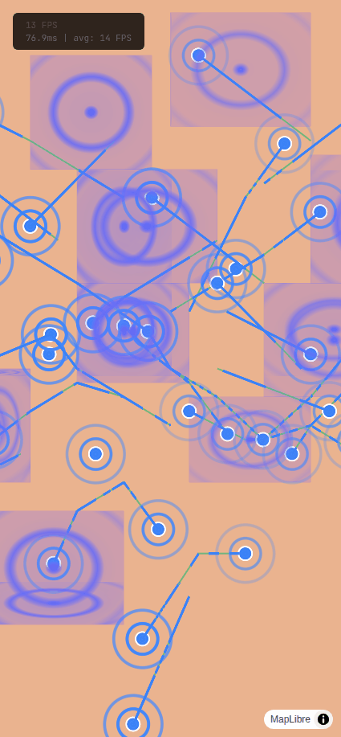

# MapLibre GL Shaders

[](https://www.npmjs.com/package/maplibre-animated-shaders)
[](https://opensource.org/licenses/MIT)
[](https://www.typescriptlang.org/)
[]()

**Animated GLSL shaders for MapLibre GL JS** - Add stunning visual effects to your maps with minimal effort.



## Features

- **26 ready-to-use animated shaders** for points, lines, polygons, and global effects
- **Plugin-based architecture** - Load only the shaders you need with thematic plugins
- **TypeScript first** - Full type safety and autocompletion
- **Zero dependencies** - Only peer dependency is MapLibre GL JS
- **Tree-shakeable** - Import only the plugins you need
- **Data-driven styling** - Use MapLibre expressions for per-feature customization
- **Interactive animations** - Per-feature play/pause/toggle via click/hover
- **High performance** - Optimized WebGL rendering with object pooling

## Demo

Run the interactive playground locally:

```bash
npm run dev:demo
```

## Installation

```bash
npm install maplibre-animated-shaders maplibre-gl
```

## Quick Start

```typescript
import maplibregl from 'maplibre-gl';
import { createShaderManager, corePlugin } from 'maplibre-animated-shaders';

// Create your map
const map = new maplibregl.Map({
  container: 'map',
  style: 'https://demotiles.maplibre.org/style.json',
  center: [2.3522, 48.8566],
  zoom: 12
});

map.on('load', () => {
  // Create a shader manager and load the core plugin
  const shaderManager = createShaderManager(map);
  shaderManager.use(corePlugin);

  // Add a GeoJSON source
  map.addSource('my-points', {
    type: 'geojson',
    data: {
      type: 'FeatureCollection',
      features: [
        {
          type: 'Feature',
          geometry: { type: 'Point', coordinates: [2.3522, 48.8566] },
          properties: {}
        }
      ]
    }
  });

  // Add a circle layer (required for point shaders)
  map.addLayer({
    id: 'my-points-layer',
    type: 'circle',
    source: 'my-points',
    paint: {
      'circle-radius': 20,
      'circle-color': '#3b82f6'
    }
  });

  // Apply a shader (namespaced with plugin name)
  shaderManager.register('my-points-layer', 'core:pulse', {
    color: '#3b82f6',
    speed: 1.5,
    rings: 3,
    maxRadius: 50
  });
});
```

## Plugin System

Shaders are organized into thematic plugins. Load only what you need for smaller bundles.

### Available Plugins

| Plugin | Shaders | Description |
|--------|---------|-------------|
| `corePlugin` | 26 | All built-in shaders (backwards compatibility) |
| `datavizPlugin` | 7 | Data visualization, progress indicators, status displays |
| `atmosphericPlugin` | 6 | Weather effects and environmental phenomena |
| `scifiPlugin` | 5 | Futuristic, technological, cyberpunk aesthetics |
| `organicPlugin` | 8 | Natural, living, and organic visual effects |

### Using Plugins

```typescript
import { createShaderManager, datavizPlugin, scifiPlugin } from 'maplibre-animated-shaders';

const shaderManager = createShaderManager(map);

// Load specific plugins for smaller bundles
shaderManager.use(datavizPlugin);
shaderManager.use(scifiPlugin);

// Use namespaced shader names
shaderManager.register('alerts-layer', 'dataviz:pulse', { color: '#ff0000' });
shaderManager.register('roads-layer', 'scifi:neon', { color: '#00ffff' });
```

### Lazy Loading Plugins

```typescript
import { createShaderManager, loadPlugin } from 'maplibre-animated-shaders';

const shaderManager = createShaderManager(map);

// Load plugins on demand (code splitting)
const dataviz = await loadPlugin('dataviz');
shaderManager.use(dataviz);
```

### Plugin Presets

Each plugin includes ready-to-use presets:

```typescript
// Get a preset configuration
const preset = shaderManager.getPreset('dataviz', 'alert-critical');
// { shader: 'pulse', config: { color: '#ff0000', speed: 2.0, rings: 3, maxRadius: 40 } }

shaderManager.register('alerts-layer', `dataviz:${preset.shader}`, preset.config);
```

## Available Shaders by Plugin

### datavizPlugin (7 shaders)

| Shader | Type | Description |
|--------|------|-------------|
| `pulse` | Point | Expanding concentric rings |
| `flow` | Line | Animated dashes flowing along path |
| `gradientTravel` | Line | Moving color gradient |
| `snake` | Line | Colored segment progressing along path |
| `scan-lines` | Polygon | Scanning horizontal/vertical lines |
| `fill-wave` | Polygon | Progressive liquid fill |
| `marching-ants` | Polygon | Animated selection border |

**Presets:** `alert-critical`, `alert-warning`, `alert-info`, `traffic-flow`, `data-stream`, `loading-wave`, `progress-fill`, `selection`

### atmosphericPlugin (6 shaders)

| Shader | Type | Description |
|--------|------|-------------|
| `heatShimmer` | Global | Heat distortion effect |
| `weather` | Global | Rain/snow/leaves particles |
| `depthFog` | Global | Animated fog based on zoom |
| `dayNightCycle` | Global | Day/night lighting variation |
| `ripple` | Polygon | Water ripples from centroid |
| `noise` | Polygon | Animated noise texture |

**Presets:** `rain-light`, `rain-heavy`, `snow-gentle`, `snow-blizzard`, `autumn-leaves`, `morning-mist`, `dense-fog`, `desert-heat`, `calm-water`, `day-cycle`

### scifiPlugin (5 shaders)

| Shader | Type | Description |
|--------|------|-------------|
| `holographicGrid` | Global | Pulsing sci-fi grid overlay |
| `electric` | Line | Sinusoidal plasma distortion |
| `neon` | Line | Neon glow with flicker |
| `radar` | Point | Rotating sweep arc |
| `glow` | Point | Luminous halo |

**Presets:** `holo-blue`, `matrix`, `plasma`, `lightning`, `cyberpunk`, `radar-scan`, `sonar`, `energy-core`, `hazard`

### organicPlugin (8 shaders)

| Shader | Type | Description |
|--------|------|-------------|
| `heartbeat` | Point | Rhythmic size pulsation |
| `particleBurst` | Point | Particles emanating from center |
| `morphingShapes` | Point | Fluid shape transitions |
| `breathing` | Line | Pulsing line width |
| `trailFade` | Line | Decreasing opacity trail |
| `dissolve` | Polygon | Dissolution effect |
| `hatching` | Polygon | Animated hatch pattern |
| `gradientRotation` | Polygon | Rotating color gradient |

**Presets:** `heartbeat-slow`, `life-pulse`, `calm-breath`, `celebration`, `firework`, `sparkle`, `fluid-morph`, `fade-out`, `rainbow-spin`, `sunset`

## API Reference

### `createShaderManager(map, options?)`

Creates a new shader manager instance.

```typescript
const manager = createShaderManager(map, {
  autoStart: true,    // Start animation loop automatically (default: true)
  targetFPS: 60,      // Target frame rate (default: 60)
  debug: false        // Enable debug logging (default: false)
});
```

### `ShaderManager` Methods

| Method | Description |
|--------|-------------|
| `use(plugin)` | Register a shader plugin |
| `unuse(pluginName)` | Unregister a plugin |
| `register(layerId, shaderName, config?)` | Apply a shader to a layer |
| `unregister(layerId)` | Remove a shader from a layer |
| `updateConfig(layerId, config)` | Update shader configuration |
| `play(layerId?)` | Resume animation |
| `pause(layerId?)` | Pause animation |
| `setSpeed(layerId, speed)` | Set speed for a specific layer |
| `setGlobalSpeed(speed)` | Set global animation speed |
| `getPlugin(name)` | Get a registered plugin |
| `hasPlugin(name)` | Check if a plugin is registered |
| `listPlugins()` | List all registered plugins |
| `destroy()` | Clean up and remove all shaders |

### Functional API

```typescript
import { applyShader } from 'maplibre-animated-shaders';

// Apply shader and get a controller
const controller = applyShader(map, 'my-layer', 'core:pulse', {
  color: '#3b82f6',
  speed: 1.5
});

// Control
controller.update({ speed: 2.0 });
controller.pause();
controller.play();
controller.remove();
```

## Data-Driven Properties

Configure shader parameters dynamically based on GeoJSON feature properties using MapLibre-style expressions.

```typescript
shaderManager.register('alerts-layer', 'dataviz:pulse', {
  // Map status to colors
  color: ['match', ['get', 'status'],
    'critical', '#ef4444',
    'warning', '#f59e0b',
    'info', '#3b82f6',
    '#6b7280'  // default
  ],

  // Interpolate radius based on magnitude
  maxRadius: ['interpolate', ['linear'], ['get', 'magnitude'],
    0, 10,
    5, 50,
    10, 100
  ],

  speed: 1.5
});
```

### Animation Time Offset

Add variety to animations by offsetting the time per feature:

```typescript
shaderManager.register('points-layer', 'organic:heartbeat', {
  color: '#ef4444',
  speed: 1.0,
  timing: {
    timeOffset: 'random',           // Random offset
    // timeOffset: ['hash', 'id'],  // Stable hash based on ID
    // timeOffset: ['get', 'delay'], // Read from property
  }
});
```

## Interactive Animation Control

Control animations on a per-feature basis via click/hover interactions.

```typescript
import { applyShader } from 'maplibre-animated-shaders';

const controller = applyShader(map, 'alerts-layer', 'dataviz:pulse', {
  color: '#ef4444',
  speed: 1.5,

  // Enable per-feature control
  perFeatureControl: true,
  initialState: 'paused',

  // Toggle animation on click
  onClick: 'toggle',

  // Play on hover
  onHover: {
    enter: 'play',
    leave: 'pause'
  }
});

// Programmatic control
controller.playFeature('feature-id-1');
controller.pauseFeature('feature-id-2');
controller.toggleFeature('feature-id-3');
controller.playAll();
controller.pauseAll();
```

## Migration from v0.x

If you were using `registerAllShaders()`, update your code:

```typescript
// Before (v0.x)
import { createShaderManager, registerAllShaders } from 'maplibre-animated-shaders';
registerAllShaders();
manager.register('layer', 'pulse', config);

// After (v1.x)
import { createShaderManager, corePlugin } from 'maplibre-animated-shaders';
manager.use(corePlugin);
manager.register('layer', 'core:pulse', config);
```

## Performance Tips

1. **Use thematic plugins** - Load only the shaders you need
2. **Limit concurrent shaders** - Each shader adds GPU overhead
3. **Use appropriate FPS** - 30 FPS is often sufficient
4. **Pause when hidden** - Save resources when the page is not visible

```typescript
const manager = createShaderManager(map, { targetFPS: 30 });

document.addEventListener('visibilitychange', () => {
  if (document.hidden) manager.pause();
  else manager.play();
});
```

## Development

```bash
# Install dependencies
npm install

# Run demo site
npm run dev:demo

# Run tests
npm test

# Run E2E tests
npm run test:e2e

# Build library
npm run build:lib

# Generate API documentation
npm run docs
```

## Contributing

See [CONTRIBUTING.md](./CONTRIBUTING.md) for development setup and guidelines.

## License

[MIT](./LICENSE) - See LICENSE file for details.

## Acknowledgments

- [MapLibre GL JS](https://maplibre.org/) - The open-source map library this project extends
